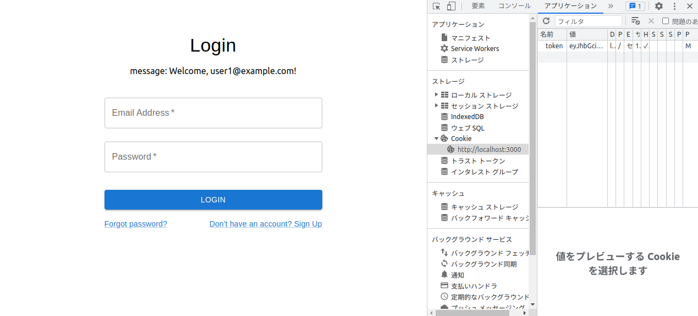

# intro
Login authentication using JWT token with next.js and typescript.<br>
After logging in, "Welcome: email address" will be displayed.<br>
There is a function to validate email and password in the lib folder.<br>

# how to use
1. prepare the environment<br>
```
git clone https://github.com/jp-north-man/nextlogin.git
cd nextlogin/
npm install bcryptjs @types/bcryptjs @types/jsonwebtoken jsonwebtoken @mui/material @emotion/react @emotion/styled
npm run dev
```    
<br>
  
2. access<br>
Access localhost.<br><br>

3. login!<br>
Enter email:user1@example.com and password:password to log in!<br><br>

